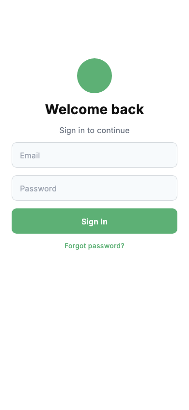
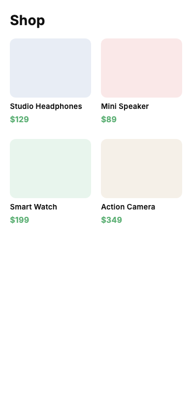
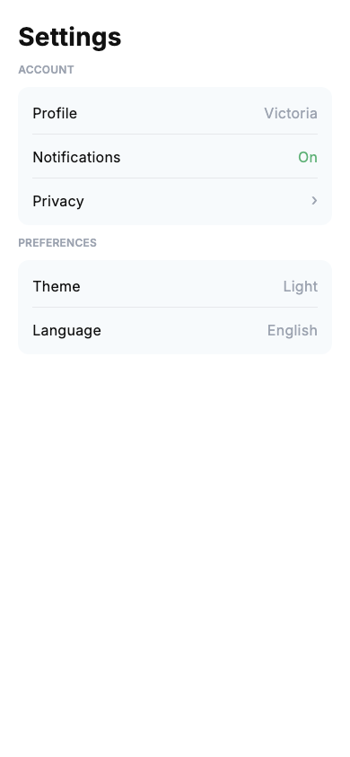
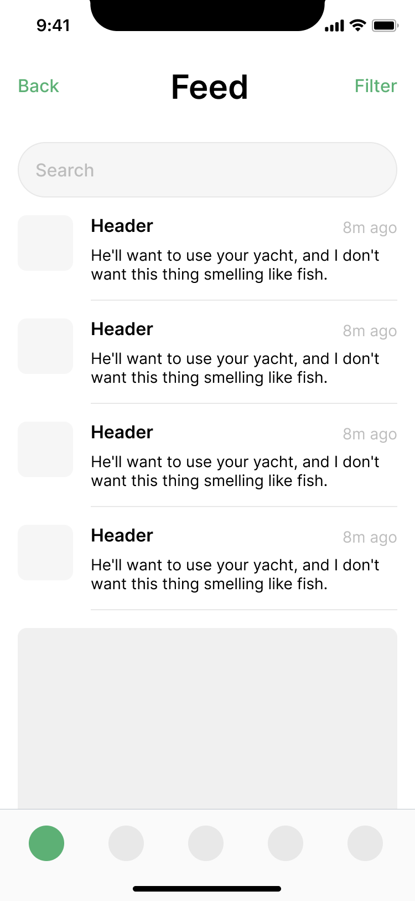
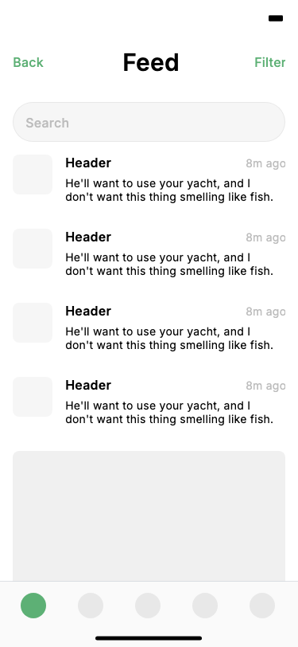

# figma-flutter-codegen

[](https://github.com/KrystalJie/figma-flutter-codegen/actions/workflows/ci.yml)

Convert a Figma mobile screen into maintainable Flutter UI code.

`figma-flutter-codegen` is a small, deterministic pipeline: it reads a Figma node
(a local JSON file or a live node URL), lowers it to a compact Design IR, plans
reusable components, and emits readable Dart (every generated file is passed
through `dart format`). Optional layers validate the output with
`flutter analyze`, diff the render against Figma for fidelity, and repair
regressions.

> Scope: Flutter only, mobile portrait, static layout. See
> [ARCHITECTURE.md](ARCHITECTURE.md) for the design rationale and
> [CLAUDE.md](CLAUDE.md) for the step-by-step development log.

## Example

A real Figma profile screen and the Flutter screen this pipeline generates from
it (rendered with `--visual-validate`):

<p align="center">
  
  
</p>

Left: the Figma node render (input). Right: the generated screen, rasterized
with the real bundled Inter font. The segmented control, layout, colors, and
typography reproduce the source; the avatar photo and status-bar icons are
fetched from Figma's image API only on a live `--figma-url` run, so they appear
blank when generating from a saved node dump.

### More demos

Three structurally different screens generated from the bundled inputs in
[`examples/`](examples/) — a centered form, a grid, and a list — exercising
auto-layout, `spaceBetween` rows, per-child fill (`layoutAlign`), nested
`Row`/`Column`, dividers, corner radius, and real fonts:

<p align="center">
  
  
  
</p>

```bash
python -m agent.cli --input examples/figma_login.json        --output flutter_app/lib/login.dart
python -m agent.cli --input examples/figma_product_grid.json --output flutter_app/lib/shop.dart
python -m agent.cli --input examples/figma_settings.json     --output flutter_app/lib/settings.dart
```

### Real-screen generalization

Validated end-to-end on two structurally different *live* Figma nodes (fetched
via the REST API, icons rasterized through the image API): a profile screen
(visual score 87) and this feed screen (score **90**, per-node geometry within
**1.2px max / 0.2px mean** of Figma's layout — `flutter analyze` clean, no
overflow):

<p align="center">
  
  
</p>

## Pipeline

```
Figma JSON ─► Design IR ─► Component Plan ─► Flutter code ─► validate ─► repair
```

- **`ir_parser`** — Figma node tree → Design IR (frames, text, rectangles,
  images, ellipses, components, icons, lines; auto-layout → flow, otherwise
  absolute Stack positioning).
- **`planner`** — IR → Component Plan: each named frame is lifted into its own
  `StatelessWidget` and structurally-identical instances are deduped, so codegen
  emits small, reusable widgets instead of one giant `build`.
- **`codegen`** — Plan → Dart. Interns repeated style literals into
  `AppColors` / `AppSpacing` / `AppTextStyles` design tokens (semantic color
  names when the Figma file publishes Styles).
- **`validator` / `repair`** — run `flutter analyze`; on failure, optionally ask
  an LLM to patch the file and re-check.

## Quickstart

**One command** (needs Flutter + Python) — regenerate a screen from a fixture,
analyze it, and smoke-test that it renders, the same sequence CI runs:

```bash
make demo          # generate -> flutter analyze -> golden smoke test
make eval          # reproduce the Case 1 visual+geometry scores (no token)
make help          # list all targets (test, generate, demos, clean, ...)
```

`make demo` writes to a gitignored scratch dir, so nothing committed is touched.

Or run the steps directly — the only runtime dependencies are Pillow and numpy:

```bash
pip install pillow numpy pytest
pytest                    # 268 tests, no network or Flutter required

# Generate a screen from the bundled sample:
python -m agent.cli \
  --input examples/figma_sample.json \
  --output flutter_app/lib/generated_screen.dart
```

The generated file passes `flutter analyze` cleanly inside `flutter_app/`.

**How do we know the generated Flutter actually works?** [CI](.github/workflows/ci.yml)
has two jobs: the Python suite, and a Flutter job that installs the SDK,
regenerates a screen from a fixture through the pipeline, runs `flutter analyze`
on it, and runs a golden **smoke test** ([widget_test.dart](flutter_app/test/widget_test.dart))
that pumps the gallery and every generated screen and asserts each builds and
lays out without throwing (a `RenderFlex` overflow fails the build). So both
"the code is valid" and "the code renders" are checked on every push.

Optionally install as a package (needs a modern pip/setuptools) to get the
`figma2flutter` command:

```bash
pip install -e .
figma2flutter --input examples/figma_sample.json --output flutter_app/lib/generated_screen.dart
```

## CLI

| Flag | Purpose |
| --- | --- |
| `--input PATH` | Local Figma node JSON (or a saved `/nodes` response). |
| `--figma-url URL` | Fetch a node live via the Figma REST API (needs a token). |
| `--figma-token TOKEN` | Figma token (defaults to `$FIGMA_TOKEN`). |
| `--output PATH` | Where to write the generated Dart. |
| `--validate` | Run `flutter analyze` after generation. |
| `--repair` | On analyze failure, ask the LLM to fix the file and re-check. |
| `--visual-validate` | Screenshot the screen and diff it against the Figma render (prints a 0–100 score). |
| `--geometry-validate` | Diff each node's rendered rect against Figma's layout (per-node position/size deviations). |
| `--repair-geometry` | Iteratively nudge node positions/sizes toward the Figma layout. |
| `--save-run` | Archive inputs, plan, output, and reports under `runs/`. |
| `--llm` | Infer flow layout — re-flow absolutely-positioned (Stack) frames into idiomatic `Row`/`Column` from their geometry. Per-frame, non-fatal. |

Run `python -m agent.cli --help` for the full set (tolerances, attempt counts,
reference images, scale factors).

### Live Figma + LLM (optional)

```bash
export FIGMA_TOKEN=...                 # Figma personal access token
export DEEPSEEK_API_KEY=...            # enables --repair / --llm (DeepSeek)
# optional: DEEPSEEK_MODEL (default deepseek-v4-flash), DEEPSEEK_BASE_URL

python -m agent.cli --figma-url "https://www.figma.com/design/<key>/...?node-id=..." \
  --output flutter_app/lib/screen.dart --repair --visual-validate
```

**The LLM is strictly opt-in.** A real call happens only when *both* are true:
(1) you pass `--repair` or `--llm`, and (2) `DEEPSEEK_API_KEY` is set. With no
flag the pipeline runs the deterministic planner and never constructs a network
client; with a flag but no key it falls back to a stub that fails loudly rather
than calling out. The default path — and the entire test suite (a fake client is
injected) — makes zero network calls.

## Metrics

`python -m agent.metrics` aggregates the headline evaluation metrics across
every saved run (`runs/`, written by `--save-run`) — no Flutter or network
calls, it just summarizes existing artifacts:

```bash
python -m agent.metrics            # human-readable report
python -m agent.metrics --json     # machine-readable aggregate
```

Reported: **compile success rate** (`flutter analyze` pass rate over validated
runs), **repair success rate** (runs the LLM fixed to passing / runs that needed
repair), **visual fidelity** (mean `visual_score` / SSIM / pixel MAE from
`visual_report.json`), **mean generated LOC**, and **component reuse ratio**
(component references ÷ distinct components in the plan). Metrics with no
underlying data report `n/a` rather than a fabricated number.

See **[docs/evaluation.md](docs/evaluation.md)** for the per-screen benchmark
(Profile + Feed real nodes and the synthetic demos), with reference-vs-generated
images and per-node geometry reports.

## What's supported

- **Nodes:** frame, text, rectangle, image, ellipse, INSTANCE/GROUP/COMPONENT,
  rounded-rect vectors, icon vectors (rasterized via the Figma image API on a
  live source), and axis-aligned LINE dividers.
- **Layout:** vertical/horizontal auto-layout (`Column`/`Row` with spacing,
  padding, alignment, `spaceBetween`), per-child counter-axis fill
  (`layoutAlign`), and absolute Stack positioning for non-auto-layout frames.
- **Style:** solid fills, borders, corner radius, image fills, real bundled
  fonts (Inter), Figma line-height, and deduped design tokens.

## Limitations

- **LLM use is opt-in and bounded.** The LLM only assists where deterministic
  rules can't: layout inference (`--llm`, Stack→flow) and analyze-error repair
  (`--repair`). Structure, geometry, and tokens stay rule-based. `--llm` does
  single-level flow inference per frame (nested regrouping is future work);
  DeepSeek v4 is text-only, so it does not consume the visual/geometry diffs.
- **Diagonal vectors, boolean operations** (arbitrary path geometry) are skipped
  with a warning (non-fatal) — only axis-aligned lines and rounded-rect vectors
  are reproduced.
- **Icon rasterization** needs a live `--figma-url` (file key + token); a
  saved-file run emits same-size placeholders so layout stays correct.
- Single mobile-portrait viewport; no interactions, state, or responsive
  breakpoints.

## Roadmap: Repair Agent

Each validation layer emits a *signal*; a **Repair Agent** closes the loop by
consuming a signal and emitting adjusted code. The target is three branches,
split by signal type:

```
Repair Agent
├── Code Repair      [implemented]  --repair
│     input:  flutter analyze log (+ current Dart)
│     output: fixed Dart code            (LLM, whole-file, live-verified)
│
├── Layout Repair    [partial]
│     input:  overflow log / rendered rects / geometry diff
│     output: adjusted layout code
│     done:   deterministic position/size nudges (--repair-geometry)
│     todo:   consume overflow logs; LLM-driven structural fixes
│             (alignment, flex, regrouping) beyond pure nudging
│
└── Visual Repair    [planned]
      input:  screenshot diff / visual score / region diff
      output: adjusted style/layout code
      signal exists (--visual-validate); no consumer yet. Blocked on model:
      DeepSeek v4 is text-only, so it needs a vision model or the visual
      diff reduced to text (per-region metric deltas) the repair LLM can act on.
```

**Code Repair** is live today (analyze-error → fixed Dart via the LLM).
**Layout Repair** exists only deterministically (`--repair-geometry` nudges
position/size from the geometry diff); the overflow-log and LLM/structural
variants are unimplemented. **Visual Repair** has its signal
(`--visual-validate`) but no repair consumer. Layout inference (`--llm`,
Stack→flow) is a *generation*-time helper, complementary to these repair loops.

## Repository layout

```
agent/       pipeline modules (cli, figma_client, ir_parser, planner, codegen,
             validator, repair, llm, tokens, images, screenshot, visual,
             geometry, geometry_repair, layout_infer, metrics, run_logger)
schemas/     Design IR + Component Plan JSON schemas
examples/    sample Figma JSON, sample Design IR, sample generated Dart
flutter_app/ Flutter gallery app (target for generated code)
tests/       pytest suite (268 tests; network and Flutter are mocked)
```

## License

[MIT](LICENSE).
